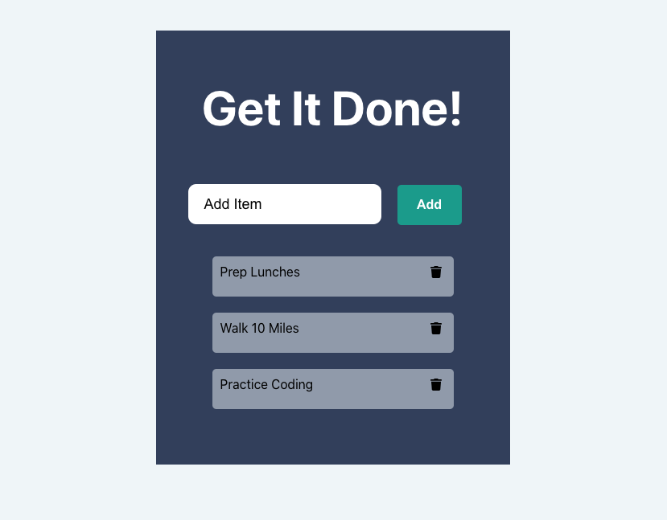

# REACT TO DO LIST APP

## Table of Contents
* Description
* User Story
* Production Team
* Demo Link
* Screenshot
* Technology
* Sources
* Additional Questions   

## Description 
To do list app created using React.

## User Story

* As a busy person, I would like a simple app to keep track of my to do list. I would like to be able to add items, and delete items when they are complete.

## Production Team
* [Alex Eesley ](https://github.com/aeesley)

## Demo Links 
[Github](https://github.com/aeesley/react-todo-list-app)

## Screenshot

## Technology
HTML, CSS, Javascript, React, FlipMove

## Sources
Followed along a Youtube tutorial at: https://www.youtube.com/watch?v=N8kYlimhuLw

## Additional Questions
If you have any questions about the project, please reach out through GitHub.
